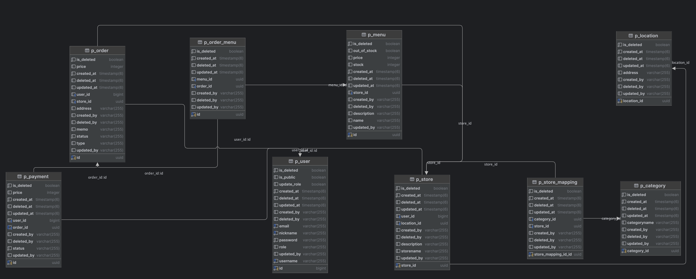

# Backend

## Summary
> - 애플리케이션 이름: Backend
> - Public IP 주소: (빈칸)
> - 포트 번호: 8080
> - 개발 환경: IntelliJ IDEA
> - API 테스트 도구: Postman
> - 빌드 도구: Gradle
> - 협업 도구: GitHub
> - 배포 환경: AWS
> - 자바 버전: 17
> - 기술 스택: Spring Boot 3.2.2, Spring Data JPA, Spring Security 6

 

## Infrastructure Architecture
### - 
> 
</img>

 

## API Document

### - RESTful API
> - 리소스 중심 설계: 리소스는 고유한 URI로 식별되며, HTTP Method와 end-point만 확인해도 어떤 기능을 위한 API인지 직관적으로 인지 가능

### - Swagger UI
> - API 문서 생성 자동화 툴
> - 웹 애플리케이션 실행 후 아래의 link에 접속하여 end-point, 요청 파라미터 등에 대한 정보를 확인
> - End-point: /swagger-ui/swagger-ui/index.html
> - link: http://localhost:8080/swagger-ui/swagger-ui/index.html

 

## DBMS
### - PostgreSQL
> - 개발 단계: Local DB
> - 배포 단계: AWS RDS

### - ER Diagram
> 

 

## Authentication
### - Spring Security 6
> - SecurityFilterChain에서 인증 및 인가를 구현
> - JWT Access Token을 사용하여